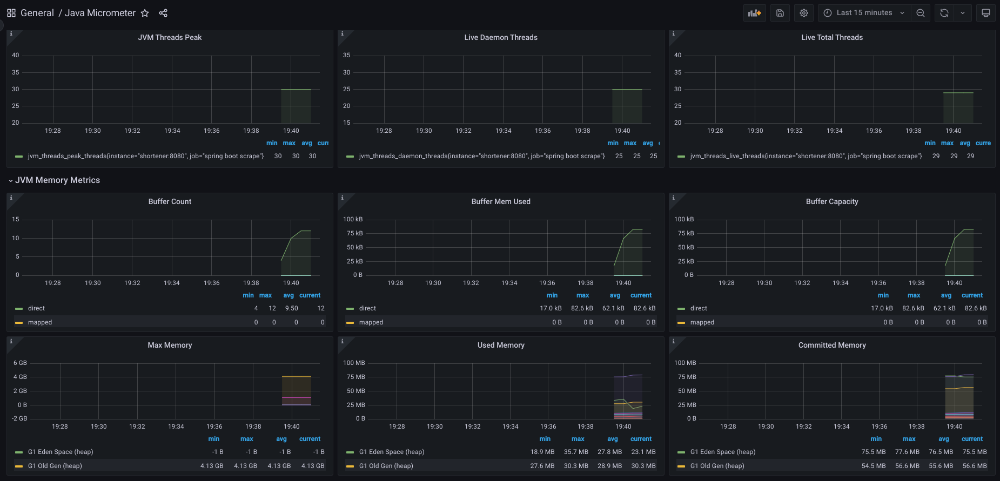

# URL Shortening Service
A URL-shortening service is developed as a minimum viable product (MVP).
The system has been limited to basic operations like address shortening and getting the original addresses.
In order to keep the project as simple as possible, rate limiting and authentication were also avoided.

## Features
### Shortening the URL
A short URL is made up of seven Base-64 encoded characters.
This method generates a total of 64 ** 7 short URLs.
In order to generate a unique string, each URL can be assigned a unique number and hashed using the MD5 algorithm.
The first seven characters of the hashed number can be extracted
after it has been encoded with the Base64 URL-encoding method.
This method is also more scalable.
Using different number ranges at each instance enables us to generate short URLs concurrently while avoiding collisions.

Zookeeper persistent sequences will be used to generate a sequence number.
When a new instance of the shortening service starts,
it will receive a unique number from the Zookeeper and multiply it by 50,000 to generate a set of sequences.
When the service reaches the end of the range, it will ask for another number, and so on.
A failed instance would only result in 50,000 possible URLs, which is quite acceptable.


### Getting the original URL from shortened URL
The shortened URLs are used as the database's ID.
When a user requests a shortened URL, the original URL is easily found by querying the database by ID.
Redis is used for caching to avoid multiple requests for each URL.

## Starting Project
Run the following command to start the project:

```
docker compose up --force-recreate --build -d
```
or 
```
docker-compose up --force-recreate --build -d
```

APIs will be accessible on port 8080.
Grafana is also can be accessed via localhost:3000.
Grafana default admin password is foobar.


*Grafana Panel*